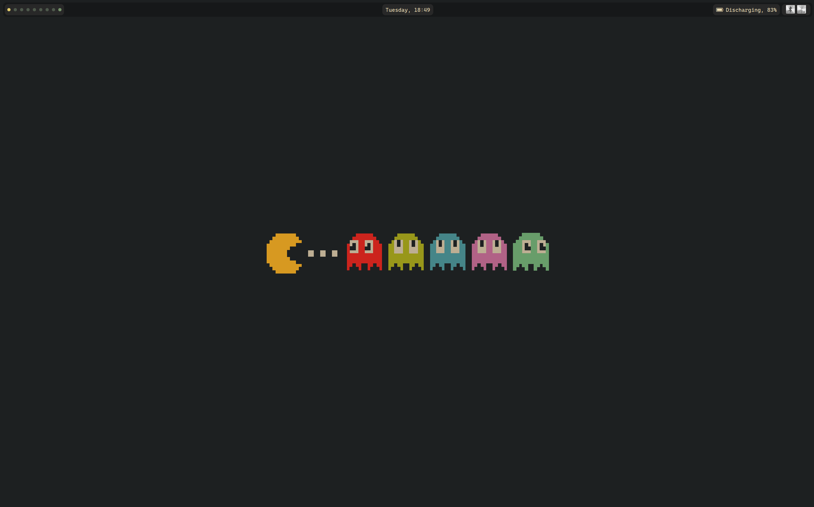
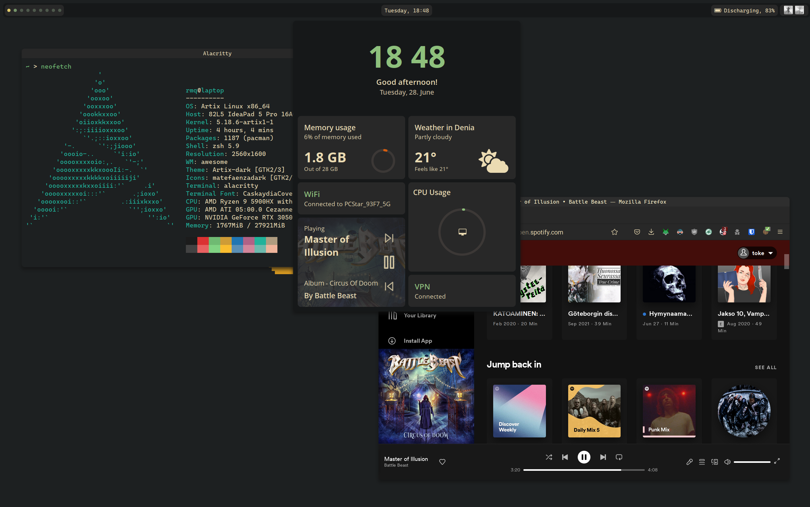

# dotfiles
Configuration files for software I use.


## Notes
I don't use awesomewm anymore myself, and some configuration 
files may've been developed to another direction (e.g. Alacritty's).
I used gruvbox colorscheme in my awesomewm configuration, and
there should be an easy way to port it to almost any application 
as it's widely used.

my `.xinitrc` starts `i3` window manager by default, and you 
may need to edit it a little if you want to launch awesome.

## AwesomeWM



### Dashboard

- Weather with caching (from weatherapi.com)
- Memory usage with graph
- Current wifi
- VPN status
- Music from current player (requires playerctl)
- CPU Usage

### Bar

- Workspaces
- Current day of the week and time in %H:%M format
- Battery status
- System tray

### Keybinds

- Brightness keys (requires brightnessctl)
- Volume keys
- Media keys (play/stop, stop, previous, next)

## Installation
Clone repo:
```sh
git clone -b awesomewm git@github.com:romeq/dotfiles.git
git clone -b awesomewm https://github.com/romeq/dotfiles.git
```

Installing dependencies (for arch):
```sh
sudo pacman -S git stow luarocks flameshot lua-http playerctl brightnessd picom coreutils gawk
sudo luarocks install lunajson
```

__NOTE:__ You need to install awesomewm from AUR (awesome-git) or clone the repository
from [github](https://github.com/awesomeWM/awesome).

Weather is fetched from [weatherapi.com](https://weatherapi.com/).
Weatherapi requires an API key, which you can get with free account.
API-key should be placed in `configuration/config.lua`

You can now install my dotfiles using `stow`
```sh
stow -t $HOME configs
```
